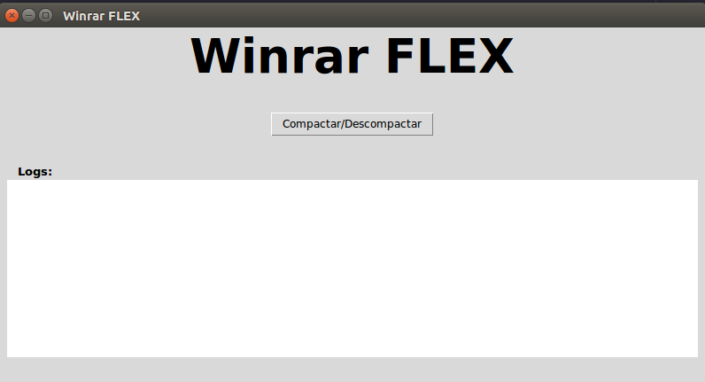
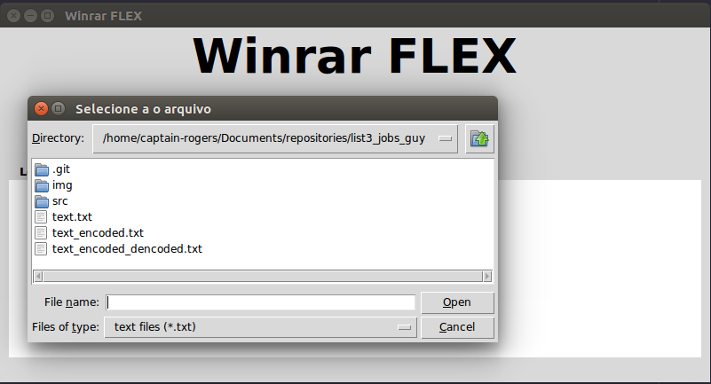
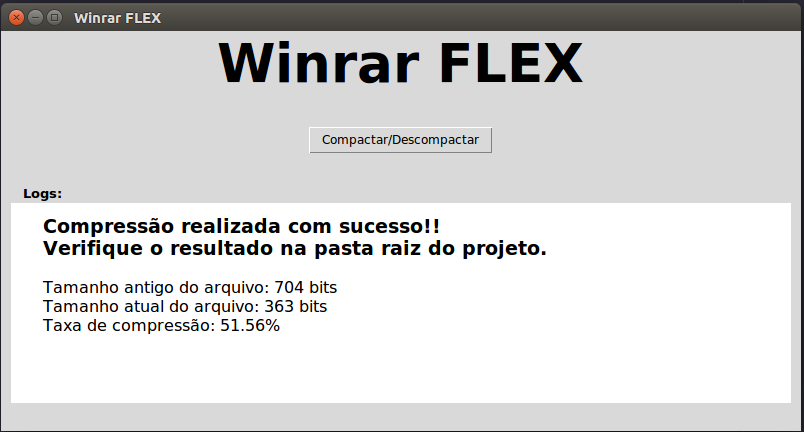
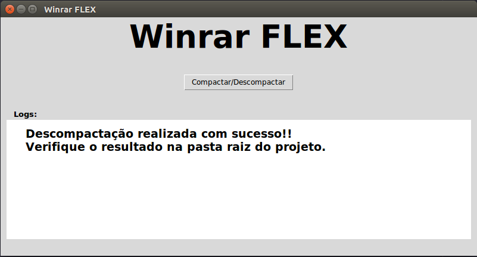

# Lista 3 - WINRAR FLEX

## Integrantes

|Matrícula| Nome|
|------|------|
| 16/0123186 | Guilherme Guy |
| 16/0128013 | Joberth Rogers |

## Conceito

Olá amigo que caiu aqui de paraquedas por acaso, estou aqui para lhe apresentar esse grande concorrente do WINRAR no ramo de compressão de dados. Usando apenas o algoritimo de huffman ele consegue compactar e descompactar arquivos do tipo txt, mas ai você diz: "Porque eu usaria isso em vez do meu amado software de compreesão?", exatamente nem nós sabemos (hahaha). Mas ao contrário do Winrar que lhe oferece uma licença de apenas 100 anos, nós oferecemos para você um suporte prologando de até 120 anos para você aproveitar e descompactar aquele episódio baixado de Game of Thrones do nosso amado Torrents ou compactar aquele projeto muito importante do final de domingo (Nem em sonho!).

## Instalando as dependências

As depêndencias usadas no projeto são:

- Tkinter
- Python3.6
  
Para instala-los rode em seu terminal o seguinte comando usando o python 3.6:

    sudo apt-get install python3-tk

## Rodando o projeto 

Após instalar as dependências rode o projeto usando o comando:

    ptyhon3.6 src/Interface.py

E verá a seguinte tela:

Ao apertar o botão no centro da tela, você poderá escolher o arquivo desejado para fazer a ação:

Ao se compactar o arquivo você receberá a seguinte mensagem, com a diferença do tamanho e a taxa de compressão do dados calculado.

E caso queira descompactar será exibido a seguinte mensagem:

#  Isso é tudo pessoal!!! Aproveitem!!! 